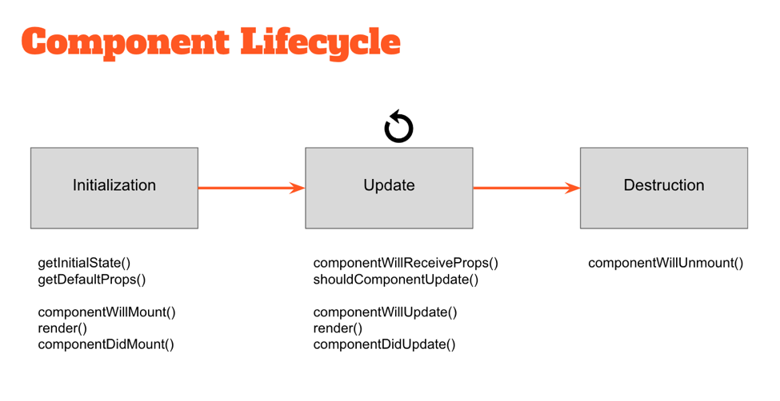

# Partner B

## Weak Sauce (1 minute)
What is your greatest weakness as a software engineer? What are you doing to overcome that weakness?

## React Component Lifecycle (5 minutes)
What happens during the lifecycle of a React component?

### Solution
(taken from [codementor](https://www.codementor.io/reactjs/tutorial/5-essential-reactjs-interview-questions))
#### High-level component lifecycle
At the highest level, React components have lifecycle events that fall into three general categories:

1. Initialization
2. State/Property Updates
3. Destruction

Every React component defines these events as a mechanism for managing its properties, state, and rendered output. Some of these events only happen once, others happen more frequently; understanding these three general categories should help you clearly visualize when certain logic needs to be applied.

For example, a component may need to add event listeners to the DOM when it first mounts. However, it should probably remove those event listeners when the component unmounts from the DOM so that irrelevant processing does not occur.
```js
class MyComponent extends React.Component {
    // when the component is added to the DOM...
    componentDidMount() {
        window.addEventListener(‘resize’, this.onResizeHandler);
    }

    // when the component is removed from the DOM...
    componentWillUnmount() {
        window.removeEventListener(‘resize’, this.onResizeHandler);
    }

    onResizeHandler() {
        console.log(‘The window has been resized!’);
    }
}
```

#### Low-level component lifecycle


Within these three general buckets exist a number of specific lifecycle hooks — essentially abstract methods — that can be utilized by any React component to more accurately manage updates. Understanding how and when these hooks fire is key to building stable components and will enable you to control the rendering process (improving performance).

Take a look at the diagram above. The events under “Initialization” only happen when a component is first initialized or added to the DOM. Similarly, the events under “Destruction” only happen once (when the component is removed from the DOM). However, the events under “Update” happen every time the properties or state of the component change.

For example, components will automatically re-render themselves any time their properties or state change. However, in some cases a component might not need to update — so preventing the component from re-rendering might improve the performance of our application.

```js
class MyComponent extends React.Component {

    // only re-render if the ID has changed!
    shouldComponentUpdate(nextProps, nextState) {
        return nextProps.id === this.props.id;
    }
}
```
**For more specific details**, go through [React docs on component lifecycle](https://facebook.github.io/react/docs/react-component.html)

## Using React (10 mins)
Say that you have an index.html page, what do you you need to do to use React on your site?

What do you need to do with React to interact with elements on the page and how does it do that?

### Solution
Part A: npm install the correct packages for React and Babel (why?), set up webpack and entry file, OR...use a CDN to just give you the libraries on your HTML page and write your code! [How to add React to a simple HTML file](https://medium.com/@to_pe/how-to-add-react-to-a-simple-html-file-a11511c0235f)

Part B: From within a component class, this.refs gives you an object containing key:value pairs of refs and DOM nodes that you will have created within this class. When you create an HTML element in your code, you can pass it a ref prop.

```render: function() { return <input placeholder='Email' ref='email' onFocus={this.onEmailFocus} />; },```

```onEmailFocus: function() { this.refs.email.blur(); }```

You can also get references to the top level node returned by any component's render function by calling

```ReactDOM.findDOMNode(componentInstance)```

[React.js By Example: Interacting with the DOM](http://jamesknelson.com/react-js-by-example-interacting-with-the-dom/)

## CSS in React

What are three ways to style React components? (10 minutes)

### Solution (inspired by [this Codeburst article](https://codeburst.io/4-four-ways-to-style-react-components-ac6f323da822))

#### Import a Stylesheet

```javascript
import React from 'react';
import './Style.css';

const SpaceCard = () => (
  <div className="SpaceCard">
    <p className="Caption">The universe is under no obligation to make sense to you.</p>
  </div>
);

export default SpaceCard;
```

##### ```Style.css```
```javascript
.SpaceCard {
  padding: 40px;
  border: 1px solid #030303;
  background-color: #000;
}

.Content {
  font-size: 20px;
  text-align: center;
}
```

#### Inline Styling

```javascript
import React from 'react';

const divStyle = {
  padding: 40px;
  border: 1px solid #030303;
  backgroundColor: #000;
};

const pStyle = {
  fontSize: 20px;
  textAlign: center;
};

const SpaceCard = () => (
  <div style={divStyle}>
    <p style={pStyle}>That is one small step for man, one giant leap for mankind.</p>
  </div>
);
```

#### Styled-Components

```javascript
import React from 'react';
import styled from 'styled-components';

const Div = styled.div`
  padding: 40px;
  border: 1px solid #030303;
  background-color: #000;
  &:hover {
   background-color: #4286f4;
 }
`;

const Paragraph = styled.p`
  font-size: 20px;
  text-align: center;
`;

const SpaceCard = () => (
  <Div>
    <Paragraph>I would like to die on Mars. Just not on impact.</Paragraph>
  </Div>
);

export default SpaceCard;
```

## Rapid Fire Trivia (15 minutes)
### Taken from [this repo](https://github.com/Pau1fitz/react-interview)

#### What are the differences between a class component and functional component?
Class components allows you to use additional features such as local state and lifecycle hooks. Also, to enable your component to have direct access to your store and thus holds state.

When your component just receives props and renders them to the page, this is a 'stateless component', for which a pure function can be used. These are also called dumb components or presentational components.

#### What is the difference between state and props?
The state is a data structure that starts with a default value when a Component mounts. It may be mutated across time, mostly as a result of user events.

Props (short for properties) are a Component's configuration. They are received from above and immutable as far as the Component receiving them is concerned. A Component cannot change its props, but it is responsible for putting together the props of its child Components. Props do not have to just be data - callback functions may be passed in as props.

#### Where in a React component should you make an AJAX request?
componentDidMount is where an AJAX request should be made in a React component. This method will be executed when the component “mounts” (is added to the DOM) for the first time. This method is only executed once during the component’s life. Importantly, you can’t guarantee the AJAX request will have resolved before the component mounts. If it doesn't, that would mean that you’d be trying to setState on an unmounted component, which would not work. Making your AJAX request in componentDidMount will guarantee that there’s a component to update.

#### What are controlled components?
In HTML, form elements such as ```<input>```, ```<textarea>```, and ```<select>``` typically maintain their own state and update it based on user input. When a user submits a form the values from the aforementioned elements are sent with the form. With React it works differently. The component containing the form will keep track of the value of the input in it's state and will re-render the component each time the callback function e.g. onChange is fired as the state will be updated. An input form element whose value is controlled by React in this way is called a "controlled component".

#### What is a higher order component?
A higher-order component is a function that takes a component and returns a new component. HOC's allow you to reuse code, logic and bootstrap abstraction. The most common is probably Redux’s connect function. Beyond simply sharing utility libraries and simple composition, HOCs are the best way to share behavior between React Components. If you find yourself writing a lot of code in different places that does the same thing, you may be able to refactor that code into a reusable HOC.

#### When rendering a list what is a key and what is it's purpose?
Keys help React identify which items have changed, are added, or are removed. Keys should be given to the elements inside the array to give the elements a stable identity. The best way to pick a key is to use a string that uniquely identifies a list item among its siblings. Most often you would use IDs from your data as keys. When you don't have stable IDs for rendered items, you may use the item index as a key as a last resort. It is not recommend to use indexes for keys if the items can reorder, as that would be slow.

#### What is the purpose of super(props)?
A child class constructor cannot make use of this until super() has been called. Also, ES2015 class constructors have to call super() if they are subclasses. The reason for passing props to super() is to enable you to access this.props in the constructor.

#### What is JSX?
JSX is a syntax extension to JavaScript and comes with the full power of JavaScript. JSX produces React "elements". You can embed any JavaScript expression in JSX by wrapping it in curly braces. After compilation, JSX expressions become regular JavaScript objects. This means that you can use JSX inside of if statements and for loops, assign it to variables, accept it as arguments, and return it from functions:

#### What is a reducer?
A reducer is simply a pure function that takes the previous state and an action, and returns the next state.

#### What is Redux Thunk used for?
Redux thunk is middleware that allows you to write action creators that return a function instead of an action. The thunk can then be used to delay the dispatch of an action if a certain condition is met. This allows you to handle the asyncronous dispatching of actions.

#### What is a pure function?
A pure function is a function that doesn't depend on and doesn't modify the states of variables out of its scope. Essentially, this means that a pure function will always return the same result given same parameters.
